# 🚀 Infrastructure Automation Platform on AWS

<p align="center">


</p>

---
<p align="center">

🎯 **Infrastructure as Code** • ☁️ **AWS** • ⚙️ **Terraform** • 🤖 **Ansible** • 🚀 **Jenkins**

</p>

# 📖 Overview

This project demonstrates a **production-inspired Infrastructure Automation Platform** built on **Amazon Web Services (AWS)** using modern **Infrastructure as Code (IaC)** and **DevOps automation** practices.

The platform provisions AWS infrastructure using **Terraform**, automatically configures servers using **Ansible**, and orchestrates the complete workflow through a **Jenkins Declarative Pipeline** with a **manual approval gate** before any infrastructure changes are applied.

The deployment includes secure networking, dynamic configuration management, containerized application deployment, and automated infrastructure validation, closely resembling a real-world DevOps workflow.

All infrastructure was deployed, configured, validated, and destroyed successfully in the **AWS ap-south-1 (Mumbai)** region.

---
## 📑 Table of Contents

- [Overview](#-overview)
- [Project Objectives](#-project-objectives)
- [Key Features](#-key-features)
- [Technology Stack](#️-technology-stack)
- [Architecture](#️-architecture)
- [High-Level Workflow](#-high-level-workflow)
- [Infrastructure Provisioned](#️-infrastructure-provisioned)
- [Repository Structure](#-repository-structure)
- [Project Highlights](#-project-highlights)
- [Terraform Architecture](#️-terraform-architecture)
- [Remote State Management](#-remote-state-management)
- [Terraform Workspaces](#-terraform-workspaces)
- [Ansible Automation](#-ansible-automation)
- [Jenkins Pipeline](#-jenkins-pipeline)
- [Setup Instructions](#️-setup-instructions)
- [Validation Performed](#-validation-performed)
- [Project Gallery](#-project-gallery)
- [Challenges & Troubleshooting](#️-challenges--troubleshooting)
- [Key Learnings](#-key-learnings)
- [Future Improvements](#-future-improvements)
- [Author](#-author)
- [License](#-license)
  
# 🎯 Project Objectives

- Provision AWS infrastructure using Terraform
- Store Terraform state remotely in Amazon S3
- Enable Terraform state locking using DynamoDB
- Build reusable Terraform modules
- Configure EC2 instances automatically using Ansible
- Implement AWS EC2 Dynamic Inventory
- Deploy a Dockerized application
- Configure NGINX as a reverse proxy
- Automate the complete workflow using Jenkins
- Implement a Manual Approval Gate before deployment
- Validate infrastructure automatically after deployment
- Follow Infrastructure-as-Code and DevOps best practices

---

# ✨ Key Features

- ✅ Modular Terraform Architecture
- ✅ Remote Terraform State (Amazon S3)
- ✅ DynamoDB State Locking
- ✅ Multi-Environment Support using Terraform Workspaces
- ✅ Dynamic AWS Inventory using Ansible
- ✅ Idempotent Configuration Management
- ✅ Dockerized Application Deployment
- ✅ NGINX Reverse Proxy Configuration
- ✅ Jenkins Controller + Dedicated Agent Architecture
- ✅ Manual Approval Stage in Jenkins Pipeline
- ✅ Automated Infrastructure Validation
- ✅ Secure Bastion Host Architecture
- ✅ Least-Privilege IAM & Security Groups
- ✅ End-to-End Infrastructure Automation

---

# 🛠️ Technology Stack

| Category | Technologies |
|-----------|--------------|
| Cloud Platform | AWS |
| Infrastructure as Code | Terraform |
| Configuration Management | Ansible |
| CI/CD | Jenkins |
| Containers | Docker |
| Reverse Proxy | NGINX |
| Operating System | Ubuntu 24.04 |
| Source Control | Git & GitHub |
| Remote State | Amazon S3 |
| State Locking | DynamoDB |

---

# 🏗️ Architecture

<p align="center">

</p>
---

# 🔄 High-Level Workflow

```text
                 Developer
                      │
                      ▼
             Push Code to GitHub
                      │
                      ▼
               Jenkins Pipeline
                      │
        ┌─────────────┴─────────────┐
        │                           │
        ▼                           ▼
 Terraform Init              Terraform Plan
        │                           │
        └─────────────┬─────────────┘
                      ▼
             Manual Approval Gate
                      │
                      ▼
              Terraform Apply
                      │
                      ▼
        AWS Infrastructure Provisioned
                      │
                      ▼
       AWS EC2 Dynamic Inventory (Ansible)
                      │
                      ▼
             Ansible Configuration
                      │
      ┌───────────────┼────────────────┐
      ▼               ▼                ▼
 Install Docker   Configure NGINX   Jenkins Agent
      │               │                │
      └───────────────┼────────────────┘
                      ▼
         Deploy Containerized Application
                      │
                      ▼
           Infrastructure Verification
                      │
                      ▼
               Pipeline Completed
```

---

# ☁️ Infrastructure Provisioned

## Networking

- Custom VPC (10.0.0.0/16)
- Public Subnet
- Private Subnet
- Internet Gateway
- NAT Gateway
- Route Tables
- Route Table Associations
- Elastic IP

### Compute

#### Bastion Host

- Ubuntu 24.04
- t3.small
- Elastic IP
- Jenkins Controller
- SSH Gateway

#### Application Server

- Ubuntu 24.04
- Private Subnet
- Docker Engine
- NGINX Reverse Proxy
- Containerized Demo Application

#### Jenkins Agent

- Ubuntu 24.04
- Private Subnet
- Dedicated Build Agent
- WebSocket Communication

### Security

- Least-Privilege Security Groups
- SSH Restricted to Administrator IP
- Private Instances Not Publicly Accessible
- Internal Communication Limited to VPC CIDR

### IAM

- IAM Role
- IAM Instance Profile

Attached Policies:

- AmazonSSMManagedInstanceCore
- CloudWatchAgentServerPolicy

---

# 📂 Repository Structure

```text
cloud-infra-automation-platform/
│
├── terraform/
│   ├── backend-bootstrap/
│   │   └── main.tf
│   │
│   ├── environments/
│   │   └── dev/
│   │       ├── backend.tf
│   │       ├── main.tf
│   │       ├── outputs.tf
│   │       ├── terraform.tfvars.example
│   │       └── variables.tf
│   │
│   └── modules/
│       ├── network/
│       ├── security/
│       ├── iam/
│       └── compute/
│
├── ansible/
│   ├── inventory/
│   │   └── aws_ec2.yml
│   ├── group_vars/
│   ├── roles/
│   │   ├── app-deploy/
│   │   ├── docker/
│   │   ├── git/
│   │   ├── java/
│   │   ├── jenkins-agent/
│   │   ├── k8s-prereqs/
│   │   └── nginx/
│   ├── ansible.cfg
│   ├── playbook.yml
│   └── requirements.yml
│
├── jenkins/
│   └── Jenkinsfile
│
├── docs/
│   └── architecture-diagram.png
│
├── screenshots/
│
├── README.md
└── .gitignore
```

---

# 📸 Project Highlights

| Screenshot | Description |
|------------|-------------|
| `screenshots/03-s3-dynamodb.png` | Remote Terraform Backend (S3 + DynamoDB) |
| `screenshots/07-vpc-console.png` | AWS Networking Resources |
| `screenshots/11-compute-apply.png` | Compute Infrastructure Provisioned |
| `screenshots/15-ansible-ping.png` | Dynamic Inventory Verification |
| `screenshots/17-idempotency-check.png` | Idempotent Ansible Execution |
| `screenshots/manual-approval-plan.png` | Jenkins Manual Approval Stage |
| `screenshots/pipeline-success.png` | Successful End-to-End Pipeline Execution |

---
# 🏗️ Terraform Architecture

The infrastructure is organized into reusable Terraform modules, making the project scalable, maintainable, and easy to extend.

## 📦 Network Module

Responsible for provisioning the networking layer:

- VPC
- Public Subnet
- Private Subnet
- Internet Gateway
- NAT Gateway
- Route Tables
- Route Table Associations
- Elastic IP

---

## 🔒 Security Module

Creates and manages Security Groups.

Features:

- SSH access restricted to the administrator's public IP
- Internal communication limited to the VPC CIDR
- Private instances inaccessible from the Internet
- Least-Privilege security model

---

## 👤 IAM Module

Creates:

- IAM Role
- IAM Instance Profile

Attached AWS Managed Policies:

- AmazonSSMManagedInstanceCore
- CloudWatchAgentServerPolicy

---

## 💻 Compute Module

Automatically provisions:

- Bastion Host
- Application Server
- Jenkins Agent

Each instance is created with the required IAM Instance Profile, Security Groups, and Tags.

---

# 🔐 Remote State Management

Terraform Remote State is configured using AWS services.

| Service | Purpose |
|---------|---------|
| Amazon S3 | Stores Terraform State |
| DynamoDB | Prevents concurrent state modifications |

## Benefits

- Shared team state
- Versioned infrastructure
- Safe collaboration
- State locking
- Supports multiple environments

---

# 🌍 Terraform Workspaces

The project supports multiple environments using Terraform Workspaces.

Validated Workspaces:

- dev
- staging

Both environments share the same Terraform code while maintaining completely isolated infrastructure and state files.

### Validation

Development Workspace

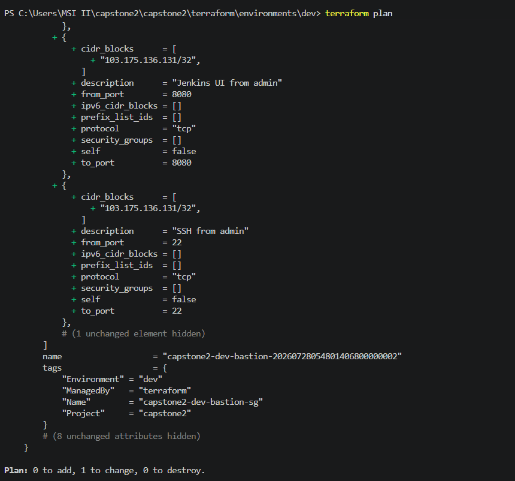

---

Staging Workspace

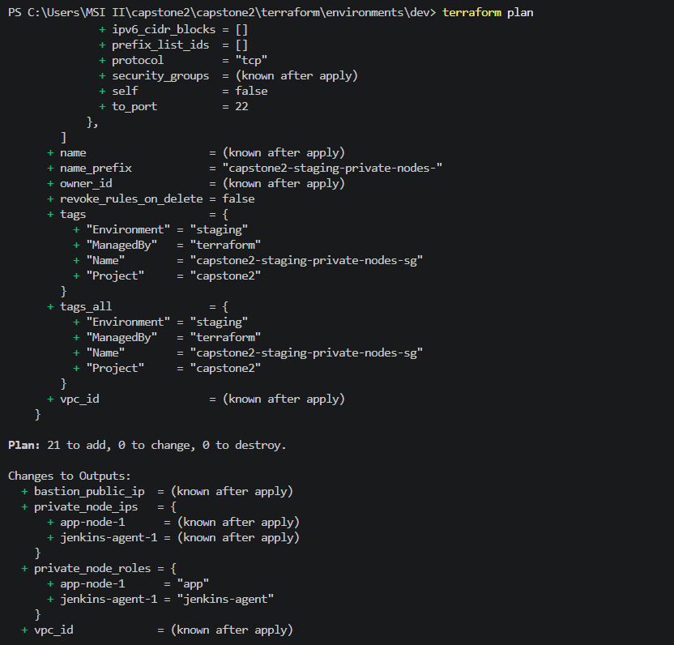

---

# 🤖 Ansible Automation

Infrastructure configuration is fully automated using Ansible.

## Dynamic Inventory

Instead of maintaining static inventory files, Ansible automatically discovers EC2 instances using the AWS EC2 Inventory Plugin.

Screenshot:

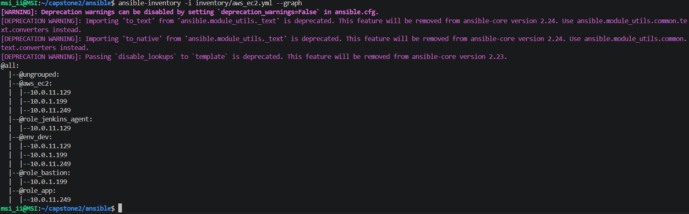

---

## Roles Implemented

### Git

- Installs Git on all managed nodes.

---

### Java

- Installs OpenJDK required by Jenkins Agent.
- Ensures the Agent Java version matches the Jenkins Controller.

---

### Docker

Automatically installs:

- Docker Engine
- Docker CLI
- Container Runtime

Also enables and starts the Docker service.

---

### Kubernetes Prerequisites

Although Kubernetes is not deployed in this project, the servers are prepared with:

- Swap disabled
- Required kernel modules
- sysctl configuration

making them Kubernetes-ready.

---

### NGINX

Configures NGINX as a Reverse Proxy.

Requests are forwarded to the Docker container hosting the application.

---

### Application Deployment

Automatically performs:

- Pull Docker image
- Start container
- Verify application health

---

### Jenkins Agent

Automatically:

- Creates Jenkins user
- Downloads latest agent.jar
- Configures systemd service
- Starts Jenkins Agent
- Connects via WebSocket

---

# 🚀 Jenkins Pipeline

The entire Infrastructure Automation workflow is orchestrated using a Jenkins Declarative Pipeline.

## Pipeline Stages

```text
Checkout
     ↓
Terraform Init
     ↓
Workspace Selection
     ↓
Terraform Plan
     ↓
Manual Approval
     ↓
Terraform Apply
     ↓
Install Ansible Collections
     ↓
Run Ansible Playbooks
     ↓
Infrastructure Verification
     ↓
Pipeline Success
```

---

## Checkout Source Code

Clones the GitHub repository.

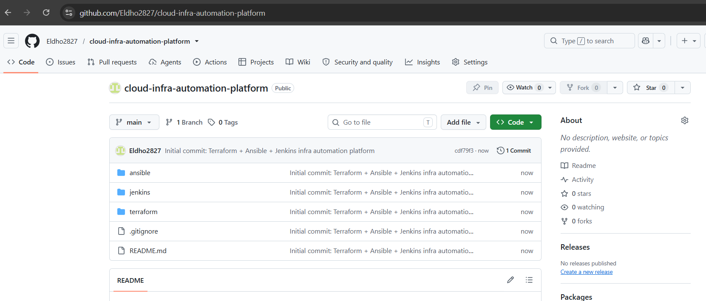

---

## Terraform Initialization

Initializes providers, modules, and backend.

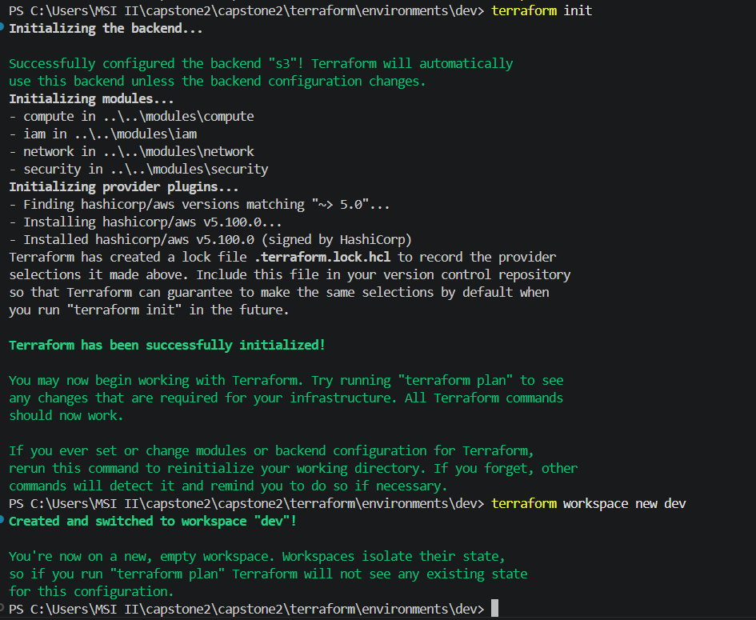

---

## Terraform Plan

Generates execution plans before deployment.

Screenshots:

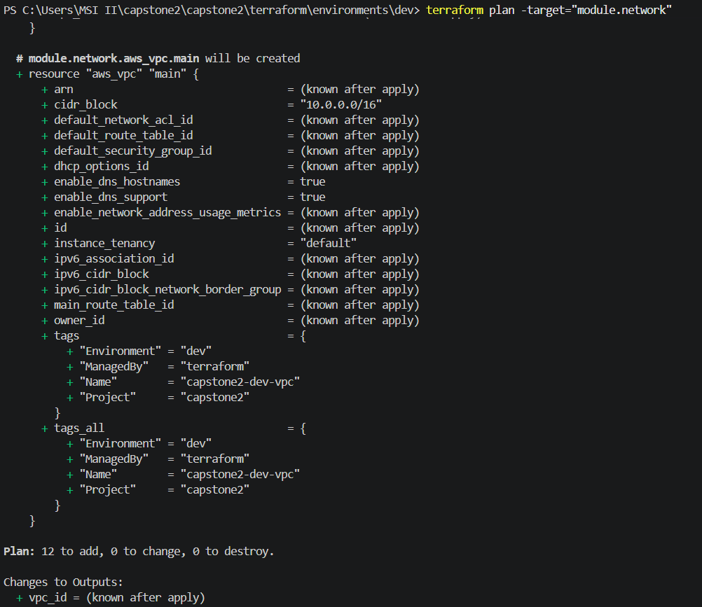

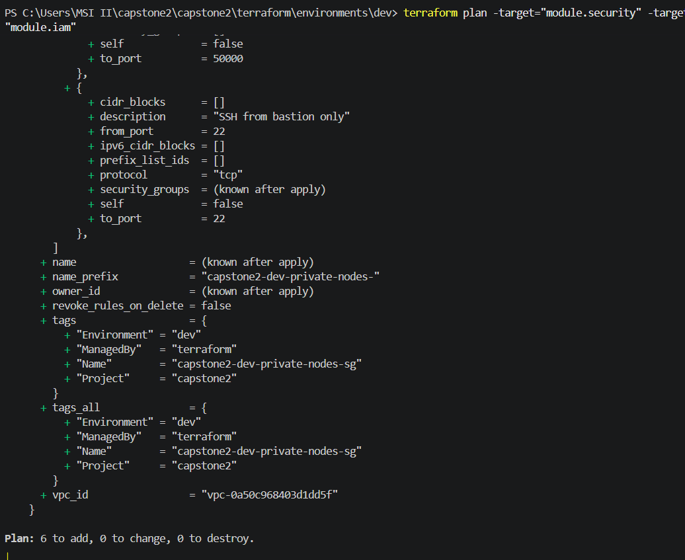

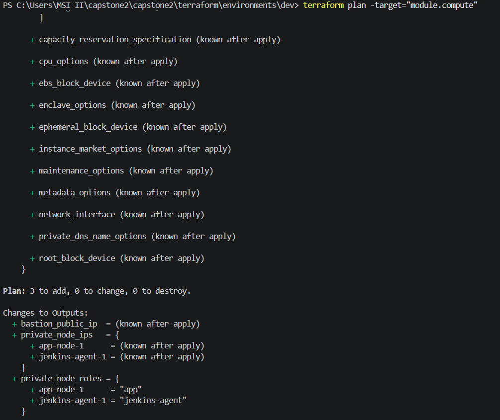

---

## Manual Approval

Infrastructure changes require human approval before deployment.


---

## Terraform Apply

Creates AWS infrastructure.

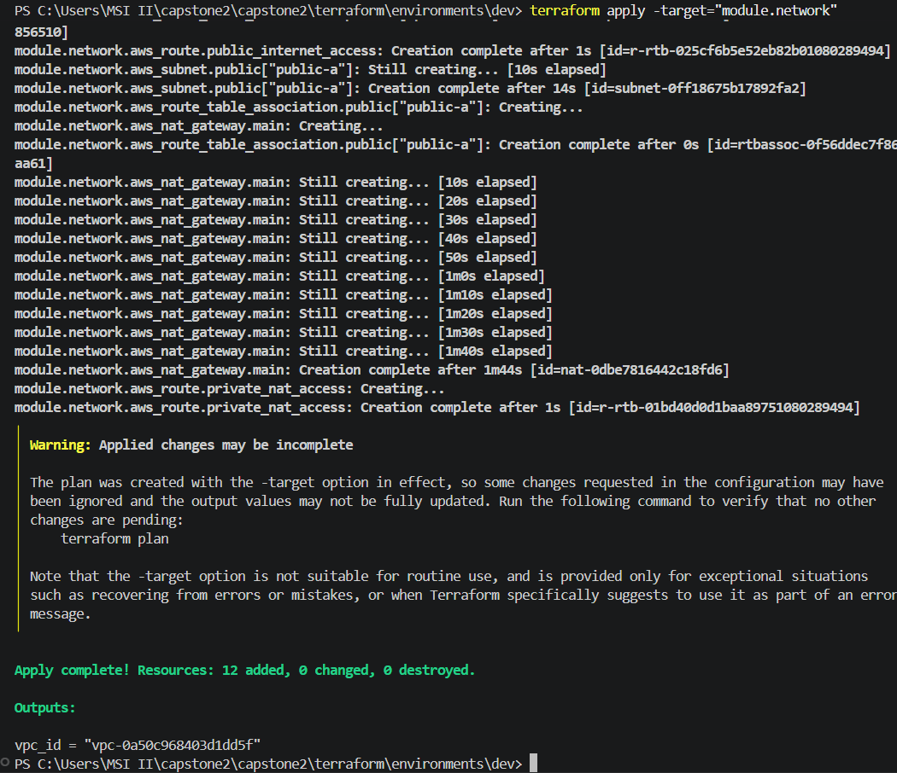

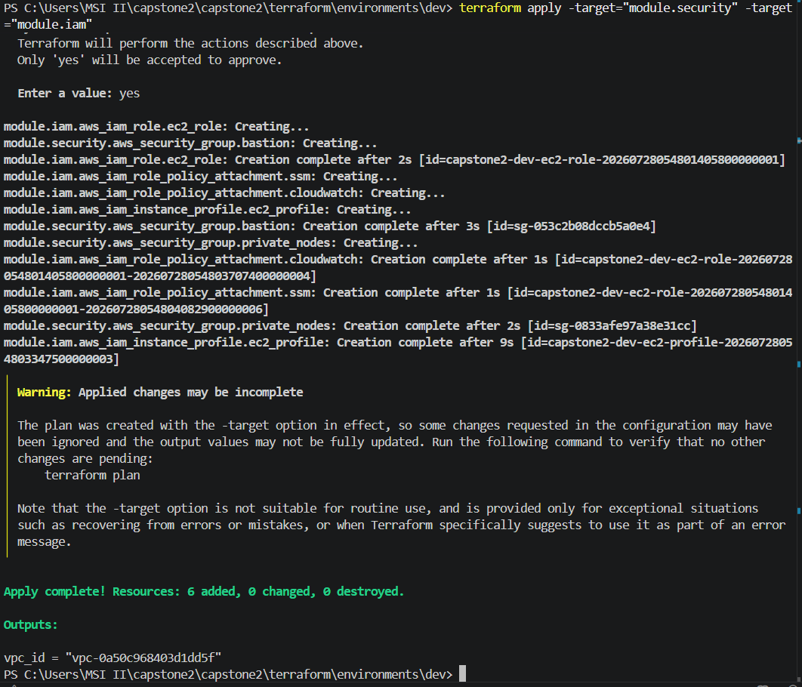

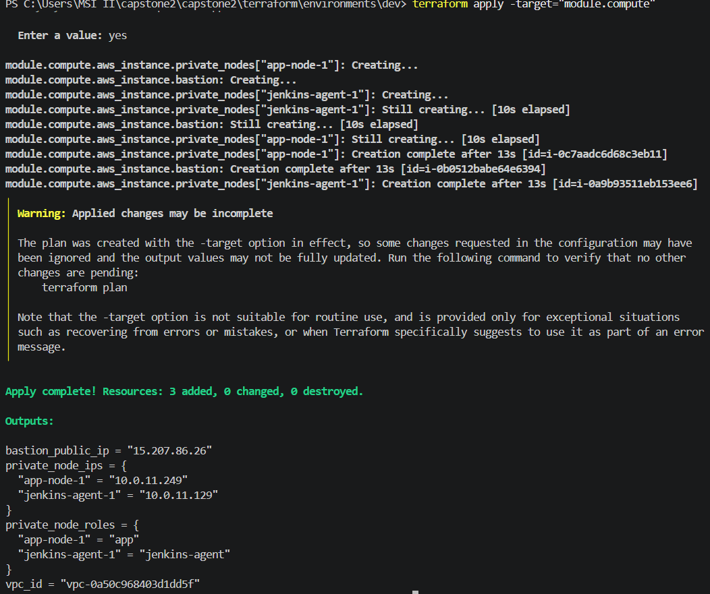

---

## Install Required Ansible Collections

Automatically installs required Ansible Galaxy collections.

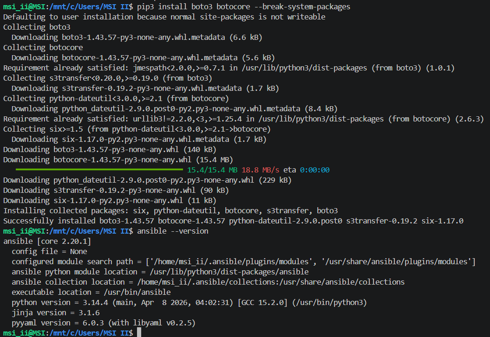

---

## Configure Infrastructure

Runs Ansible playbooks to configure every server.

Tasks include:

- Git
- Docker
- Java
- Kubernetes prerequisites
- NGINX
- Jenkins Agent
- Application Deployment

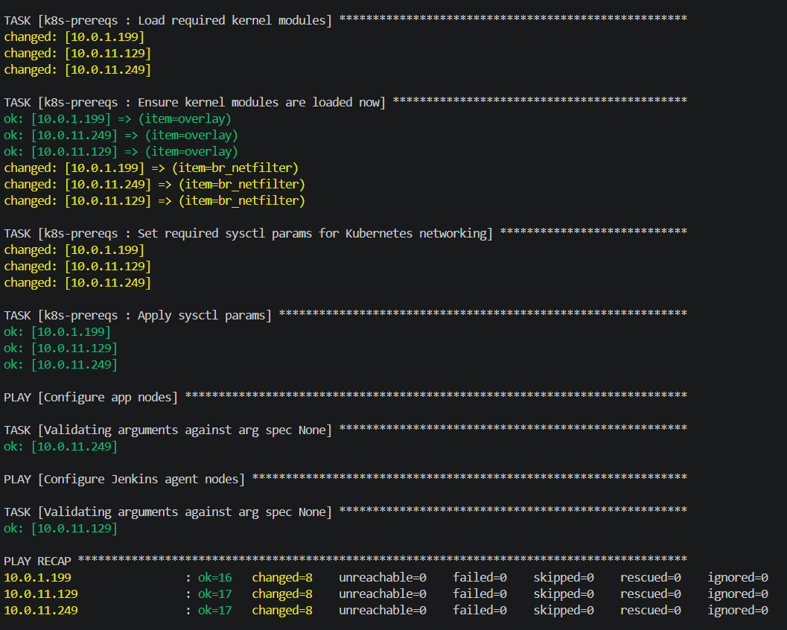

---

## Verify Idempotency

Running the playbook again results in **zero unnecessary changes**, confirming idempotent automation.


---

## Infrastructure Verification

The pipeline validates:

- SSH Connectivity
- Application Health
- Jenkins Agent Connectivity
- Infrastructure Status


---

# ⚙️ Setup Instructions

## Clone Repository

```bash
git clone https://github.com/Eldho2827/cloud-infra-automation-platform.git

cd cloud-infra-automation-platform
```

---

## Bootstrap Terraform Backend

```bash
cd terraform/backend-bootstrap

terraform init

terraform apply
```

---

## Configure Variables

```bash
cd ../environments/dev

cp terraform.tfvars.example terraform.tfvars
```

Update:

- AWS Region
- Key Pair
- Administrator IP
- Instance Type
- VPC CIDR

---

## Initialize Terraform

```bash
terraform init
```

---

## Create Workspace

```bash
terraform workspace new dev
```

---

## Provision Infrastructure

```bash
terraform plan

terraform apply
```

---

## Configure Servers

```bash
cd ../../../ansible

ansible-playbook playbook.yml
```

---

## Execute Jenkins Pipeline

Run the Jenkins pipeline.

The pipeline automatically performs:

- Infrastructure Provisioning
- Server Configuration
- Docker Deployment
- Jenkins Agent Configuration
- Infrastructure Verification

---

# ✅ Validation Performed

| Validation | Status |
|------------|--------|
| AWS Credentials Verified | ✅ |
| Remote Backend Configured | ✅ |
| Terraform Modules Tested | ✅ |
| Infrastructure Provisioned | ✅ |
| Bastion SSH Access | ✅ |
| Dynamic Inventory Working | ✅ |
| Ansible Playbooks Successful | ✅ |
| Docker Application Running | ✅ |
| Jenkins Agent Connected | ✅ |
| Health Endpoint Verified | ✅ |
| Workspace Isolation Verified | ✅ |
| DynamoDB State Locking Verified | ✅ |
| Full Terraform Destroy Tested | ✅ |

---

# 📸 Project Gallery

## AWS Identity Verification

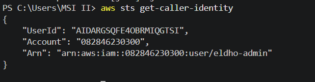

---

## Remote Backend


---

## AWS Networking


---

## Bastion SSH

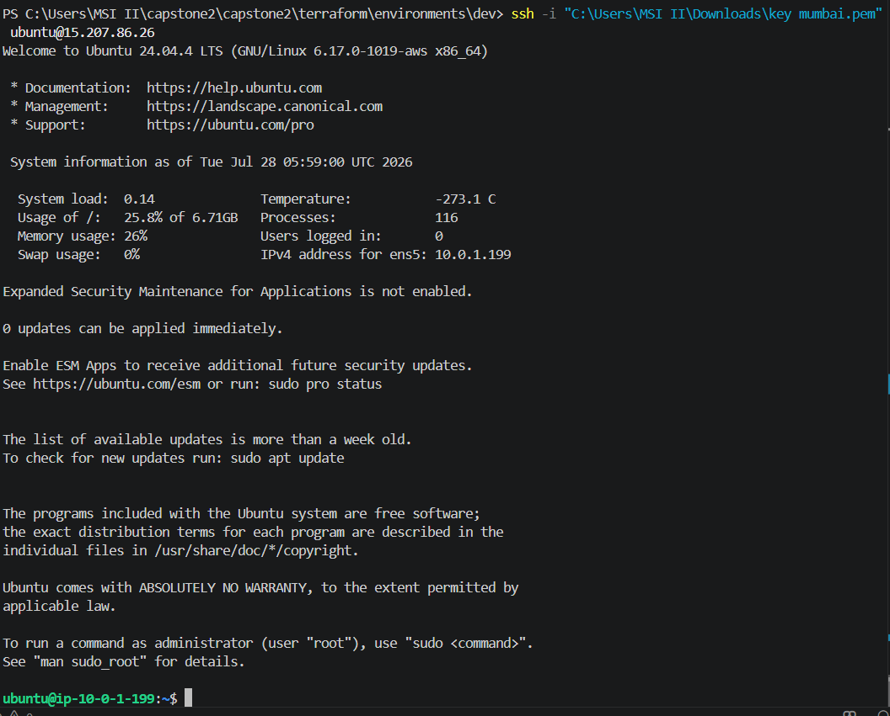

---

## EC2 Infrastructure

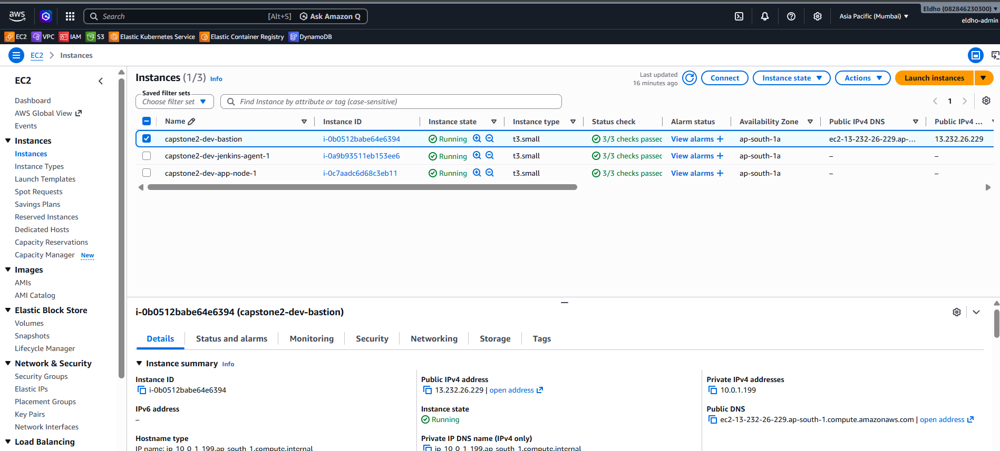

---

## Dynamic Inventory


---

## Ansible Connectivity


---

## Jenkins Dashboard

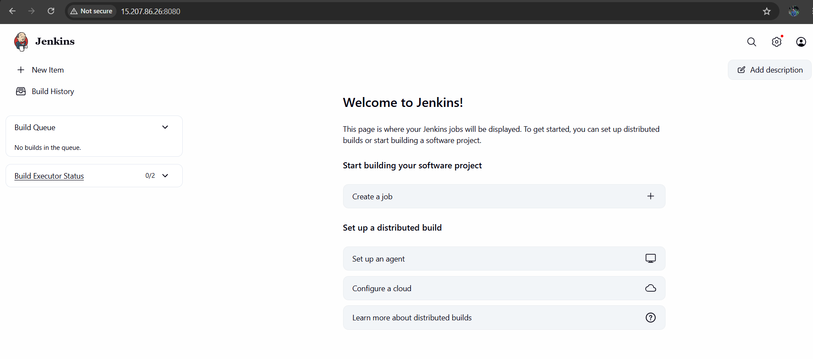

---

## Jenkins Agent Online

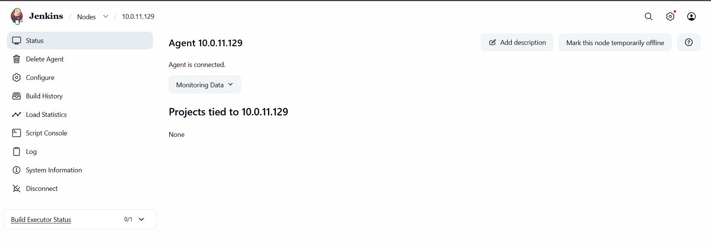

---

## Successful Pipeline


---

## DynamoDB State Lock Verification

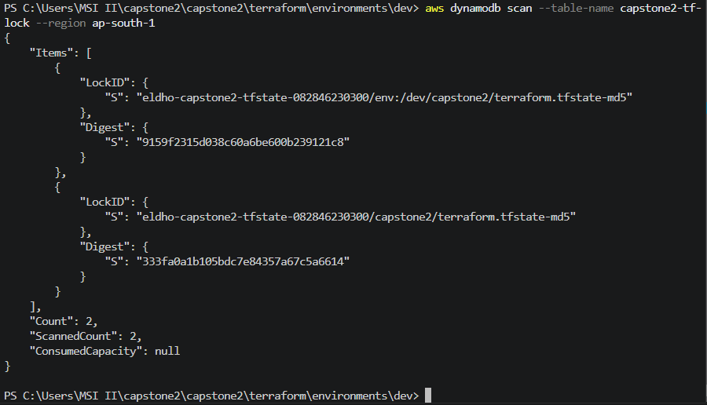

---

# 🛠️ Challenges & Troubleshooting

## 1. VPC Hairpin NAT Issue

**Problem**

Ansible running on the Bastion Host could not SSH to private instances using the Bastion's public IP.

**Solution**

Use private IPs for communication inside the VPC and reserve the public IP only for external access.

---

## 2. Jenkins Agent Java Version Mismatch

**Problem**

The Jenkins Agent failed with:

```text
UnsupportedClassVersionError
```

**Solution**

Installed the same Java version (OpenJDK 21) on both the Jenkins Controller and Jenkins Agent.

---

## 3. Jenkins Controller Memory Exhaustion

**Problem**

A `t3.micro` instance frequently became unresponsive while running Jenkins, Terraform, and Ansible.

**Solution**

- Added temporary swap space
- Upgraded to `t3.small` for stable execution

---

## 4. Dynamic Inventory Variable Precedence

**Problem**

Variables defined in `group_vars` did not override values from the AWS Dynamic Inventory.

**Solution**

Moved the required overrides to `host_vars`, which have higher precedence.

---

## 5. Jenkins Connectivity

**Problem**

The Jenkins Agent could not connect to the Jenkins Controller.

**Solution**

Updated the Bastion Security Group to allow port **8080** from the VPC CIDR while keeping public access restricted to the administrator IP.

---

# 📚 Key Learnings

Through this project I gained practical experience with:

- Infrastructure as Code using Terraform
- Modular Terraform Design
- AWS Networking
- Remote Terraform State
- Terraform Workspaces
- EC2 Provisioning
- IAM Best Practices
- Dynamic Inventory using Ansible
- Configuration Management
- Idempotent Automation
- Docker Deployment
- Jenkins Declarative Pipelines
- Jenkins Controller-Agent Architecture
- Secure Infrastructure Design
- Troubleshooting Real Production Scenarios

---

# 🚀 Future Improvements

Possible enhancements include:

- Multi-AZ deployment
- Application Load Balancer
- Auto Scaling Groups
- Route 53 Integration
- HTTPS using ACM
- Prometheus & Grafana Monitoring
- AWS Secrets Manager
- SonarQube Integration
- Trivy Image Scanning
- Slack Notifications
- Blue-Green Deployment
- Canary Deployment
- Amazon EKS Migration

---


# 📄 License

This project is licensed under the **MIT License**.

---
# 👨‍💻 Author

## Eldho Sabu

**AWS DevOps Engineer**

<p align="left">

<a href="https://github.com/Eldho2827">

</a>

<a href="https://www.linkedin.com/in/eldho-sabu">

</a>

</p>
