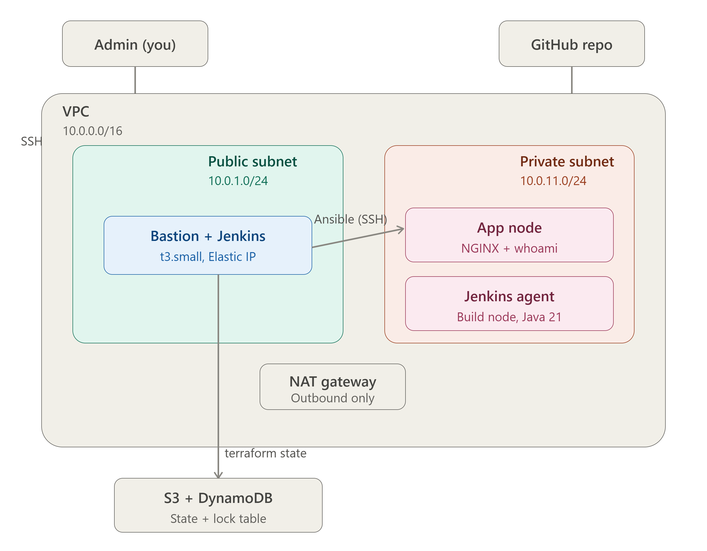
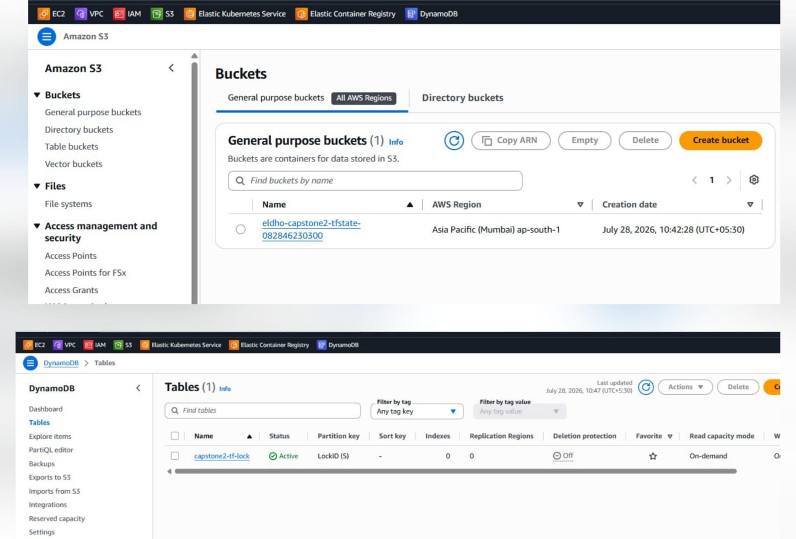
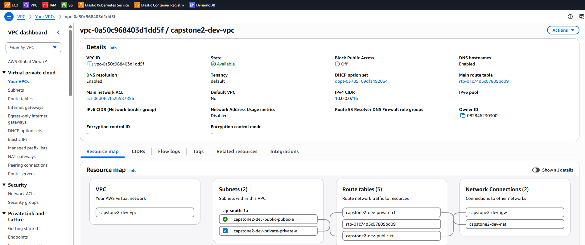
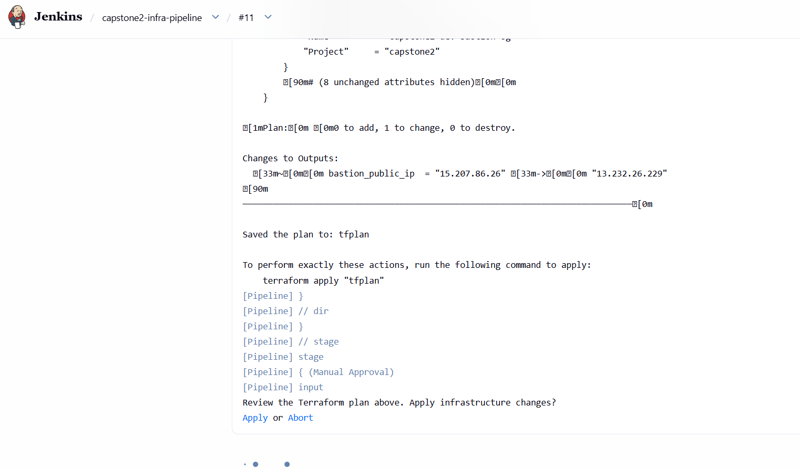
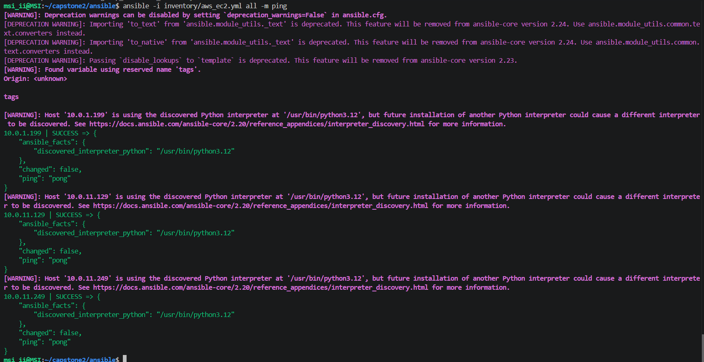
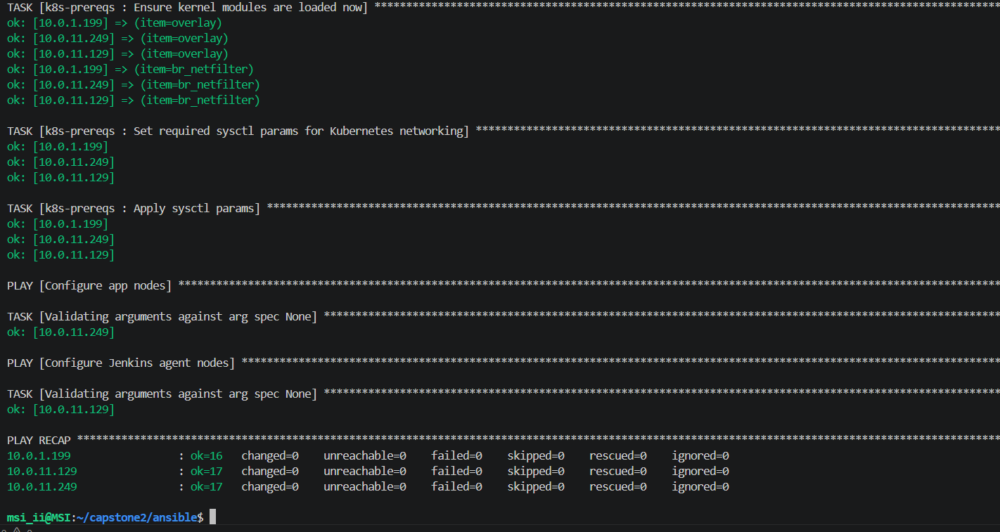
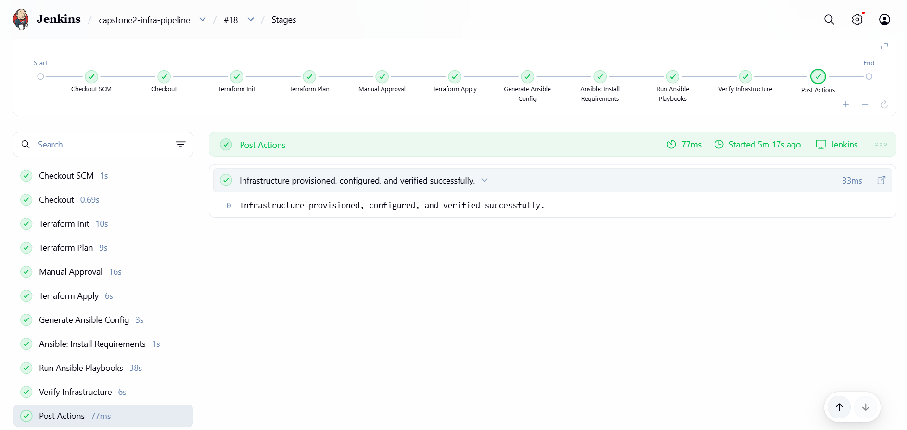

# Infrastructure Automation Platform on AWS

<p align="center">


</p>

<p align="center"><strong>A self-service AWS infrastructure pipeline: request → plan → approve → provision → configure → verify — with zero manual server setup.</strong></p>

---

## Why this project

Most infrastructure work in a real team isn't "spin up one server" — it's "provision it safely, the same way, every time, with a human checkpoint before anything touches production." This project builds that workflow end-to-end: Terraform provisions the AWS environment, Ansible configures every server automatically, and a Jenkins pipeline ties it together with a **manual approval gate** before any change is applied.

Everything below was deployed live in AWS (`ap-south-1`, Mumbai) — provisioned, validated, and cleanly destroyed. Screenshots throughout are from that real run, not a simulation.

**What it demonstrates:**
- Modular, reusable Terraform (network / security / IAM / compute)
- Remote state with locking (S3 + DynamoDB) — safe for team collaboration
- Multi-environment support via Terraform Workspaces (`dev`, `staging`), fully isolated
- Zero-touch server configuration via Ansible's dynamic AWS inventory (no static IP lists)
- A CI/CD pipeline with a real governance step — not just "push to deploy"
- Idempotent automation, proven by re-running the playbook with zero changes on the second pass

---

## Architecture

<p align="center">

</p>

**Network:** Custom VPC (`10.0.0.0/16`) with public + private subnets, Internet Gateway, NAT Gateway, and route tables.

**Compute:**
| Instance | Role | Placement |
|---|---|---|
| Bastion Host | SSH gateway + Jenkins Controller | Public subnet |
| Application Server | Docker + NGINX reverse proxy + demo app | Private subnet |
| Jenkins Agent | Dedicated build agent (WebSocket) | Private subnet |

**Security:** Least-privilege security groups — SSH restricted to the administrator's IP, internal traffic scoped to the VPC CIDR, private instances never internet-facing.

**IAM:** Instance role with `AmazonSSMManagedInstanceCore` and `CloudWatchAgentServerPolicy` attached — no long-lived credentials on the boxes.

---

## Pipeline flow

```text
Push to GitHub
      │
      ▼
Jenkins: Checkout → Terraform Init → Terraform Plan
      │
      ▼
Manual Approval Gate  ◄── human sign-off before anything is applied
      │
      ▼
Terraform Apply  →  AWS infrastructure provisioned
      │
      ▼
Ansible (dynamic EC2 inventory) configures every node:
   Docker · NGINX · Java · Jenkins Agent · App Deployment
      │
      ▼
Automated Verification (SSH, app health, agent connectivity)
      │
      ▼
Pipeline Success
```

---

## Repository structure

```text
cloud-infra-automation-platform/
├── terraform/
│   ├── backend-bootstrap/        # S3 + DynamoDB remote state setup
│   ├── environments/dev/         # Root module for the dev environment
│   └── modules/                  # network, security, iam, compute
├── ansible/
│   ├── inventory/aws_ec2.yml     # Dynamic AWS inventory
│   └── roles/                    # docker, nginx, java, git, jenkins-agent, app-deploy
├── jenkins/Jenkinsfile
├── docs/architecture-diagram.png
└── screenshots/
```

---

## Terraform design

| Module | Responsibility |
|---|---|
| **network** | VPC, subnets, IGW, NAT Gateway, route tables |
| **security** | Security groups — SSH locked to admin IP, VPC-internal traffic only |
| **iam** | IAM role + instance profile with least-privilege managed policies |
| **compute** | Bastion, application server, Jenkins agent — each wired with the above |

**Remote state:** Terraform state lives in S3 with DynamoDB state locking, so concurrent applies can't corrupt state — the same pattern a team would use in production.

**Workspaces:** `dev` and `staging` share identical code but maintain fully isolated infrastructure and state. Verified by planning a `staging` workspace from scratch (21 net-new resources, zero collision with `dev`).

---

## Ansible automation

Instead of a static inventory file, Ansible discovers every EC2 instance automatically via the **AWS EC2 dynamic inventory plugin** — new instances are configured with no manual wiring.

| Role | What it does |
|---|---|
| `git`, `java` | Baseline tooling; Java version pinned to match the Jenkins Controller |
| `docker` | Installs and enables the Docker engine |
| `k8s-prereqs` | Preps nodes to be Kubernetes-ready (swap disabled, kernel modules, sysctl) |
| `nginx` | Reverse proxy, forwarding to the app container |
| `app-deploy` | Pulls the image, starts the container, verifies health |
| `jenkins-agent` | Provisions the Jenkins user, agent.jar, systemd service, WebSocket connection |

**Idempotency was verified, not assumed:** running the full playbook a second time returned `changed=0` across every host.

---

## Setup

```bash
git clone https://github.com/Eldho2827/cloud-infra-automation-platform.git
cd cloud-infra-automation-platform

# 1. Bootstrap remote state
cd terraform/backend-bootstrap
terraform init && terraform apply

# 2. Configure environment
cd ../environments/dev
cp terraform.tfvars.example terraform.tfvars   # set region, key pair, admin IP, CIDR

# 3. Provision infrastructure
terraform init
terraform workspace new dev
terraform plan && terraform apply

# 4. Configure servers
cd ../../../ansible
ansible-playbook playbook.yml

# 5. Run the Jenkins pipeline for the full automated flow
```

---

## Validation performed

| Check | Result |
|---|---|
| Remote backend (S3 + DynamoDB) | ✅ |
| Terraform modules — plan & apply | ✅ |
| Bastion SSH access | ✅ |
| Dynamic Ansible inventory | ✅ |
| Idempotent playbook re-run | ✅ |
| Docker app + NGINX health check | ✅ |
| Jenkins agent connectivity | ✅ |
| Workspace isolation (dev/staging) | ✅ |
| DynamoDB state locking | ✅ |
| Full `terraform destroy` — clean teardown | ✅ |

---

## Project gallery

| | |
|---|---|
|  *Remote backend* |  *Networking* |
|  *Manual approval gate* |  *Dynamic inventory* |
|  *Idempotency proof* |  *Pipeline success* |

---

## Troubleshooting highlights

A few real issues hit during the build, and how they were resolved:

- **VPC hairpin NAT** — Ansible on the bastion couldn't reach private nodes via the bastion's public IP. Fixed by routing internal traffic over private IPs, reserving the public IP for external access only.
- **Jenkins agent `UnsupportedClassVersionError`** — Controller and agent were on mismatched JDK versions. Fixed by pinning both to OpenJDK 21.
- **Controller memory exhaustion** — `t3.micro` couldn't handle Jenkins + Terraform + Ansible concurrently. Added swap, then moved to `t3.small` for stable headroom.
- **Inventory variable precedence** — `group_vars` overrides were being ignored in favor of AWS dynamic inventory values. Resolved by moving overrides to `host_vars`, which take precedence.
- **Agent–controller connectivity** — Blocked until the bastion security group allowed port 8080 from the VPC CIDR, while keeping public access locked to the admin IP.

---

## What I'd add next

Multi-AZ deployment · Application Load Balancer · Auto Scaling · Route 53 + ACM (HTTPS) · Prometheus/Grafana monitoring · AWS Secrets Manager · Trivy/SonarQube scanning · Slack notifications · Blue-green / canary deployment · EKS migration.

---

## Author

**Eldho Sabu** — AWS DevOps Engineer

<p align="left">
<a href="https://github.com/Eldho2827"></a>
<a href="https://www.linkedin.com/in/eldhosabu08"></a>
<a href="https://hub.docker.com/u/eldho10"></a>
</p>

---
